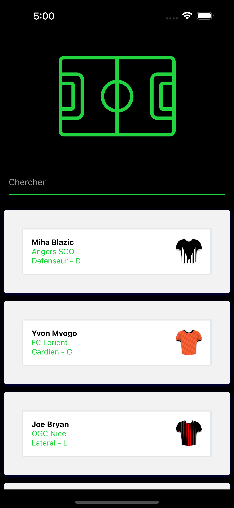
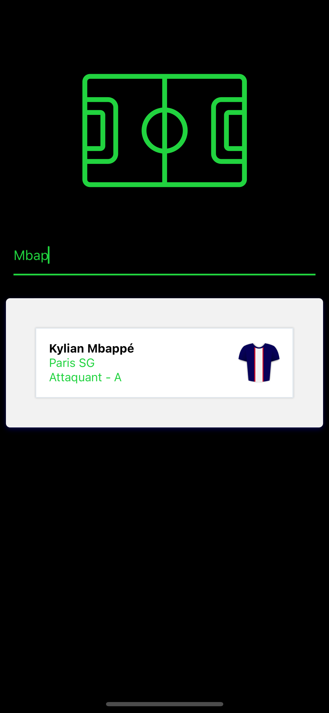
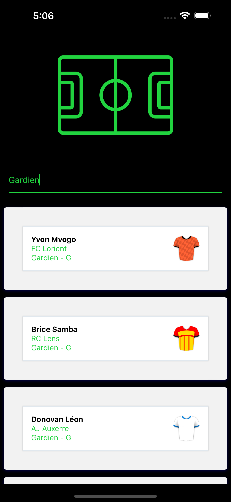
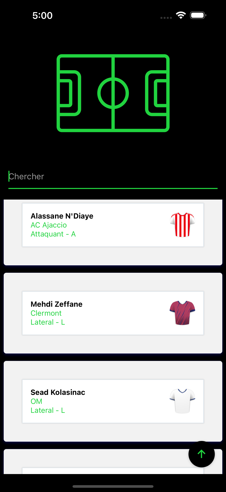
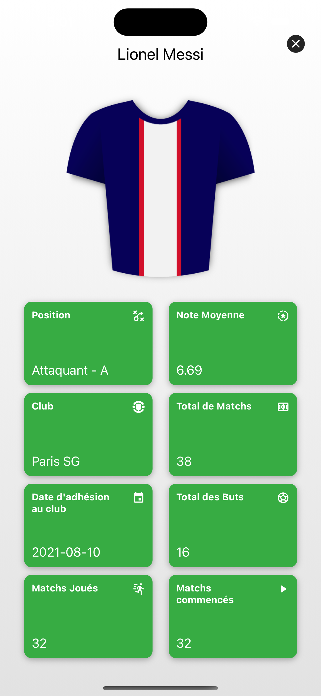

# MPG Test Technique

L'application a été développée avec React Native et TypeScript. Elle affiche une liste de joueurs de football et offre la possibilité d'effectuer des recherches parmi ces joueurs. Elle permet également d’afficher une fiche détaillée pour chaque joueur. L'interface utilisateur est entièrement adaptif, s'adaptant donc à toutes les tailles d'écran pour une expérience optimale sur tous les appareils.

## Comment exécuter l'application

Pour exécuter cette application sur votre machine locale, suivez les étapes ci-dessous :

1. **Clonez le dépôt :** Clonez le dépôt\*\*

2. **Naviguez dans le répertoire du projet**
3. **Installez les dépendances :** Installez les dépendances du projet en utilisant la commande suivante :
   ```npm install```
4. **Lancez l'application :** Assurez-vous d'avoir un émulateur Android ou iOS en cours d'exécution, ou un appareil connecté. Ensuite, pour lancer l'application, exécutez l'une des commandes suivantes :
   ```
   npm run android // Pour Android
   npm run ios // Pour iOS
   npm start
   ```
   Vous devriez maintenant voir l'application s'exécuter sur votre émulateur ou appareil connecté.

## Écran Joueurs (PlayersScreen)

Sur l'écran Joueurs, l'application affiche une liste de joueurs dans un composant `FlatList`. Cela optimise les performances, en particulier pour les grandes listes.




La liste peut être filtrée en utilisant la barre de recherche en haut de l'écran. La recherche est insensible à la casse et peut être effectuée soit par le nom du joueur, soit par sa position.




Une fois que vous avez commencé à faire défiler la liste, un bouton apparaît en bas à droite pour vous permettre de revenir rapidement en haut de la page.



## Écran du Joueur Individuel (SinglePlayerScreen)

Lorsque vous cliquez sur un joueur dans la liste, vous êtes redirigé vers une fiche détaillée pour ce joueur. Cet écran affiche des informations supplémentaires sur le joueur, qui sont récupérées à partir de trois points de terminaison API distincts.




## Cartes de Joueurs (JoueursCards)

Le composant JoueursCards est utilisé pour afficher les informations sur chaque joueur dans la liste sur l'écran Joueurs. Il affiche le nom du joueur, sa position, et l'image du maillot par défaut de leur club.

